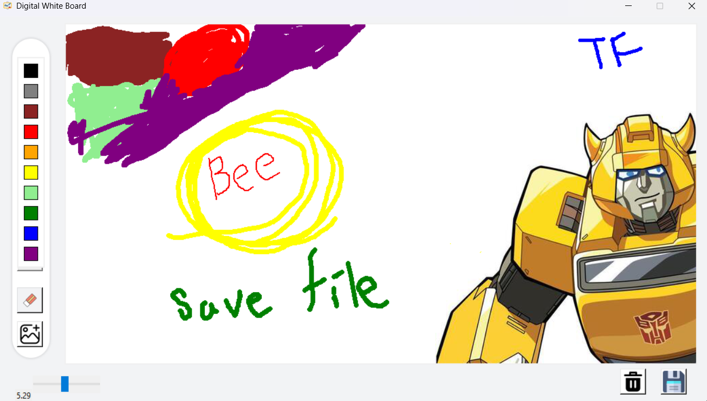

# 🖊️ Digital Whiteboard App

A fully functional digital whiteboard application built using **Tkinter** that allows you to draw, erase, insert and move images, choose colors, undo/redo, clear the screen, and save your drawings.

---

## 🎯 Features

- ✅ Draw freehand with adjustable thickness
- ✅ Color palette for quick selection
- ✅ Eraser tool
- ✅ Undo & Redo drawing strokes
- ✅ Insert images and move them around
- ✅ Clear entire screen
- ✅ Save canvas as `.png` 
- ✅ Simple, user-friendly UI with icons

---

## 📸 Screenshot



---

## 🛠️ Technologies Used

- Python
- Tkinter (GUI)
- PIL (Pillow) for image capture
- `ImageGrab` for saving the canvas
- FileDialog for image import

---

## 📦 Requirements

Install Python packages (Pillow):

```bash
pip install pillow
```
## 🖼️ Image Handling
- Use the 📷 Add Image button to import .png images.
- Click and drag to move the inserted image.
- Images are placed on the canvas at position (180, 50).

## 🧼 Clear Screen
- Erases everything on the canvas, including drawings and images.
- Does not delete saved files.

## 📌 Known Limitations
- Redo functionality is currently unimplemented.
- Only supports .png for image insertion.
- Limited GUI scaling for very large screens.

## 👨‍💻 Author
Supan Roy
